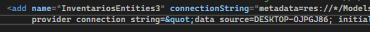
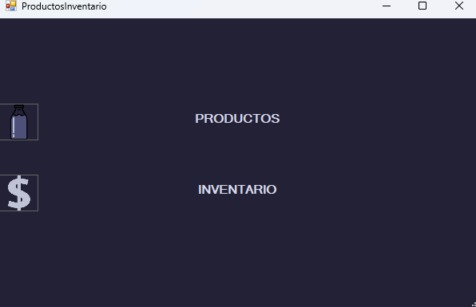
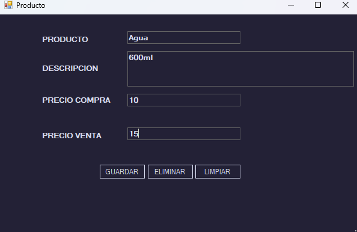
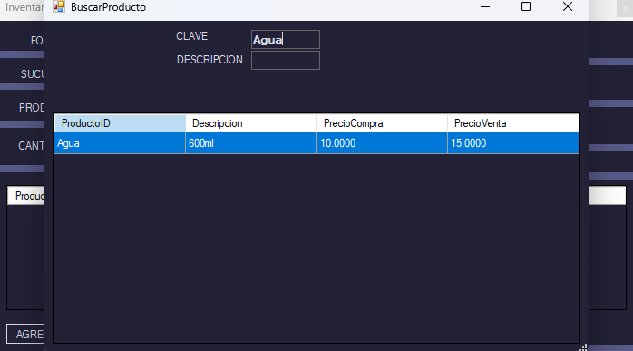
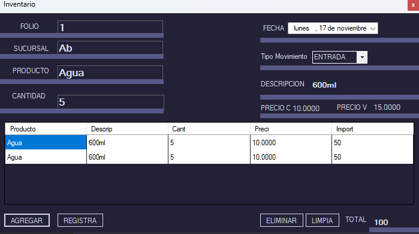
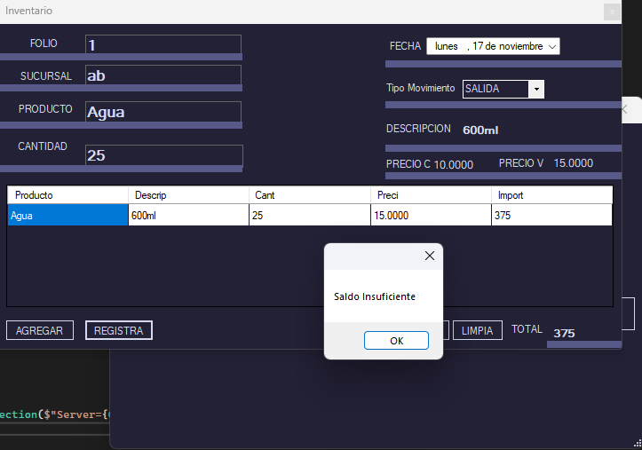

# Proyecto de Inventario

Este es un proyecto de inventario desarrollado en C# con SQL Server como base de datos. El objetivo del proyecto es gestionar los productos en el inventario, proporcionando funcionalidades para agregar, eliminar y visualizar productos.

## Características

- **Gestión de productos:** Agregar y eliminar productos del inventario.
- **Consulta de inventario:** Visualizar la lista de productos disponibles con detalles como nombre, cantidad y precio.
- **Búsqueda:** Buscar productos en el inventario por nombre o descripción.
- **Transacciones:** Registrar y gestionar transacciones en C# para controlar el movimiento de productos en el inventario.
- **Triggers:** Uso de triggers para actualizar la tabla cuando se registre un movimiento

-Uso de Lenguaje de definición de datos (Data Definition Languague)

-Uso de Lenguaje de manipulación de datos (Data Manipulation Languague)

-Uso de transacciones en C#

-Uso de triggers en la base de datos de SQL

-Uso de base de datos relacional simple

** Para lograr la conexión con la base de datos primero se tiene que esepecificar el servidor al que se conectará. Esto se modifica en el archivo App.config

## -- Inicio de sesión

## -- Sección Producto/Inventario

## -- Sección Producto

## -- Búsqueda de productos previamente agregados

## -- Sección Inventario / Movimiento tipo entrada

## -- Sección Inventario / Movimiento tipo salida

